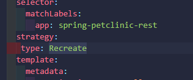

### Nama : Shaquille Athar Adista
### Kelas : C

1. Membuka logs pertama kali sebelum menjalankan services

   Membuka logs setelah menjalankan servcies untuk pertama kalinya

   Membuka logs setelah menjalankan servcies untuk kedua kalinya

     Pada gambar terlihat perbedaan di bagian `GET /`, Awalnya kita tidak mencatat request apapun pada logs, namun setelah service di expose maka pada log akan tercatat `GET /`, hal ini terjadi karena setelah service di expose maka service dapat menerima request dan setiap request yang diterima akan dicatat ke dalam logs.
    
2. Perbedaan antara penggunaan `-n` dan tanpa `-n` pada `kubectl get` adalah  `-n` digunakan jika kita ingin menspesifik namespace yang ditargetkan, hal ini akan sangat berguna jika kita memiliki beberapa namespace di dalam kluster kubernetes kita. Jika kita menggunakan `kubectl get` tanpa `-n` maka kubectl akan menggunakan namespace default. Alasan mengapa pods/service yang sudah saya buat tidak muncul di output ketika menggunakan `kubectl get pods,services -n kube-system` adalah dikarenakan kubectl sudah menspesifikan namespace `kube-sytem` sehingga hanya data yang ada pada namaspace `kube-system` saja yang muncul.

### Rolling Update & Kubernetes Manifest File

1. Perbedaan antara rolling update dengan recreate deployment adalah dalam rolling update, instance baru dari pod dijalankan satu persatu sambil secara bertahap menghentikan dan menggantikan instance lama dengan yang baru. Hal ini membuat aplikasi akan tetap berjalan tanpa downtime yang signigikan. Sedangkan dalam recreate deployment. semua instancte pod dihentikan secara bersamaan dan kemudian diperbarui dengan instance baru yang memuat versi terbaru dari aplikasi. Hal ini akan menyebabkan aplikasi akan mengalami downtime selama proses pembaruan.

2. set up 
   

   edit deployment

   

   ganti ke versi terbaru
   

   delete pod
   

   akan dibuat ulang pod menggatikan pod yang sudah dihapus
   

   run dan akan open swagger
   
   

3. Strategi dengan menggunakan rollingUdate

   

   Strategi dengan menggunakan Recreate

   

   Jalankan yaml yang sudah kita buat dan akan terlihat bahwa strategy yang diterapkan adalah recreate.Penjelasan gambar adalah kita set image baru agar pod lama di repliclas lama terhapus dan akan dibuat pod baru di repliclas baru dapat terlihat saat menjalankan get replicates.
   

   

   

   Disini untuk mengganti strategi yang ingin digunakan kita dapat mengganti `strategy` dan `type` sesuai dengan kebutuhan.

4. Keuntungan dari memakai manifest file di kubernetes adalah efisiensi dikarenakan kita tidak perlu melakukan proses secara manual dan bisa langsung automasi sesuai file yang kita terapkan. Selain itu dengan menggunakan manifest file kita dapat memastikan konfigurasi aplikasi dan infrastrukur kubernetes yang kita produksi dan kelola sudah pasti konsisten di berbagai lingkungan. Manifest file juga dapat disimpan sehingga memungkinkan untuk melacak perubahan yang terjadi dan melakukan rollback serta berkolaborasi dengan anggota tim dalam pengembangan dan pengelolaan aplikasi.
